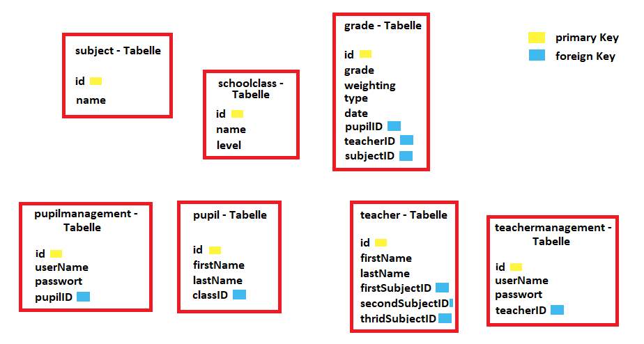

# Projekt Arbeit von Robin Brang und Viktoria Heinen

### Agenda 
- Backend
- Frontend
- Zusätzliche Features
- Datenmodell

&nbsp;

### Backend
Im Hintergrund unserer Notenverwaltung steht eine MySQL Datenbank. Dort werden alle Daten hinterlegt und abgespeichert. 
Als Schnittstelle an die Datenbank fungiert das Backend. Hier können Daten aus der Datenbank ausgelesen und eingespeichert werden. 

&nbsp;

### Frontend
Für das UI/UX verwenden wir Java Swing. Es ermöglicht die grafische Darstellung und die Handhabung des Backends. 
 

&nbsp;

### Zusätzliche Features 
Zusätzlich zum Frontend verwenden wir die pdf-Engine Aspose, um dem Benutzer eine aufbereitete pdf-Datei zur Verfügung zu stellen, welche die gewünschten Daten aus der Datenbank enthält.
Ein weiteres Feature unserer Notenverwaltung ist eine umfassende Benutzerverwaltung. Nicht nur ermöglicht sie es zu entscheiden, wer alles Zugriff auf die App hat, auch ist es möglich für jeden Benutzer einen individuellen Benutzername und ein Passwort zu vergeben.
Die Benutzerverwaltung ermöglicht uns, eine für den Schüler und Lehrer angepasste Sicht der bereitzustellen. 

&nbsp;

### Datenmodell

